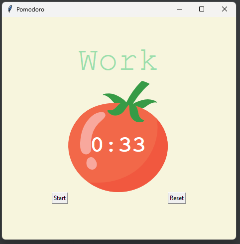

# Responsive GUI Pomodoro App

This project implements a Pomodoro timer with a graphical user interface (GUI) that helps users manage work and break intervals effectively. The timer is based on the Pomodoro technique, promoting focused work sessions followed by short and long breaks.

## Features

1. **Timer Functionality**:
   - Cycles through 25-minute work sessions, 5-minute short breaks, and 20-minute long breaks.
   - Automatically transitions between work and break sessions.

2. **User Controls**:
   - Start and reset the timer using intuitive buttons.

3. **Visual Feedback**:
   - Displays a checkmark for each completed work session.
   - Highlights the current session (Work/Break) with appropriate colors.

4. **Responsive Design**:
   - Built using Tkinter for a simple and responsive user interface.
  
## Screenshots



## Tools Used

- **Tkinter**: For creating the GUI.
- **time**: Used via `window.after` for countdown functionality.
- **Global Variables**: To manage timer states.

## How to Use

1. **Start the Timer**:
   - Click the "Start" button to begin the timer.
   - The timer will cycle through work and break sessions automatically.

2. **Reset the Timer**:
   - Click the "Reset" button to stop the timer and reset all states.

3. **Track Progress**:
   - View checkmarks displayed at the bottom of the app, indicating completed work sessions.

## Requirements

- Python 3.x
- Tkinter (pre-installed with Python)

## Installation

1. Clone the repository:
   ```bash
   git clone https://github.com/yourusername/responsive-gui-pomodoro.git
   ```

2. Navigate to the project directory:
   ```bash
   cd responsive-gui-pomodoro
   ```

3. Run the application:
   ```bash
   python main.py
   ```

## File Structure

- `main.py`: The main Python script containing the Pomodoro timer logic.
- `tomato.png`: The image displayed in the timer GUI.

## Notes

- The Pomodoro duration and break times can be customized in the constants section of the `main.py` file.
- Ensure the `tomato.png` file is present in the same directory as `main.py` for the app to display correctly.

## License

This project is licensed under the MIT License. See the `LICENSE` file for details.
